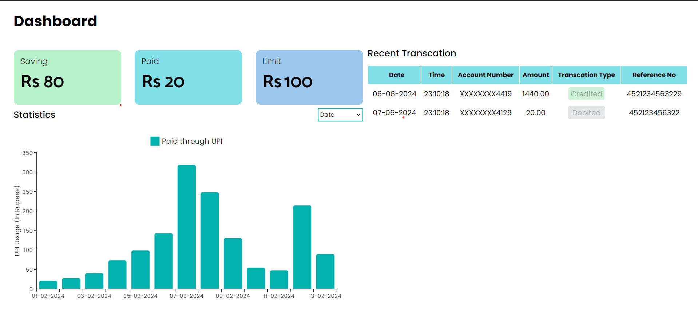

# UPI Transaction Tracker

## Description

The UPI Transaction Tracker is a web application designed to monitor and manage Unified Payments Interface (UPI) transactions in real-time. It tracks mobile messages to detect UPI transactions and provides users with essential transaction details such as Account Number, Amount, Transaction Type (Debit/Credit), UPI Reference Number, and Timestamp. Users can set custom transaction limits to receive alerts when approaching or exceeding their set limits, ensuring financial security and control.

## Features

- **Real-time Transaction Tracking:** Monitor UPI transactions as they occur, providing transparency and visibility into your financial activities.
- **Custom Transaction Limits:** Set personalized transaction limits to manage spending and receive alerts when nearing or surpassing set limits.
- **Comprehensive Transaction Details:** Access detailed transaction information including Account Number, Amount, Transaction Type, UPI Reference Number, and Timestamp.
- **User-Friendly Interface:** Navigate the application with ease using our intuitive user interface, designed for simplicity and efficiency.
- **Custom Alerts and Notifications:** Receive customizable alerts and notifications to stay informed about important transaction events.

## Installation

1. Clone the repository: `git clone https://github.com/Das786/UPIMoneyTracker.git`
2. Install dependencies: `npm install`
3. Start the development server: `npm start`
4. Access the application in your browser at `http://localhost:3000`

## Usage

1. Set your desired transaction limits in the application settings.
2. Navigate to the transaction dashboard to view real-time transaction activity.
3. Receive alerts and notifications when approaching or exceeding set transaction limits.
4. Analyze transaction details and manage your financial activities with ease.
5. You analyze using bar graph based on month and datewise.

## Contributing

We welcome contributions from the community! If you find any issues or have suggestions for improvements, please submit a pull request or open an issue on GitHub.

## License

This project is licensed under the [MIT License](https://opensource.org/licenses/MIT).

## Contact

For inquiries or support, please contact us at john004959@gmail.com.

---
